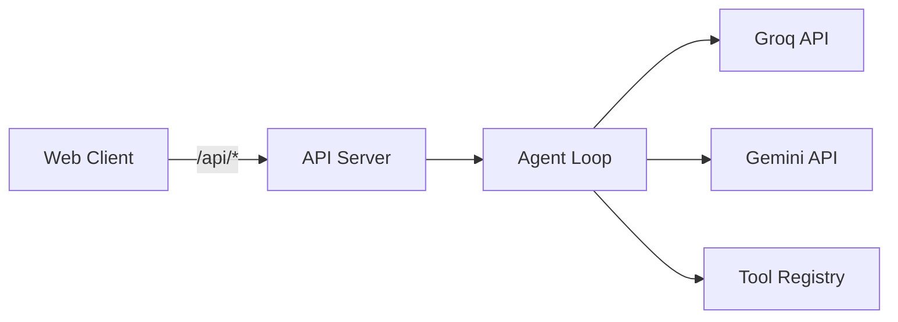

# Agentic AI — Django + React

Full-stack agentic AI assistant with **Groq**, **Google Gemini**, or **Hugging Face**, per-user **agents**, and a **tool registry**.

## Architecture



## Monorepo layout

```
agentic-ai-platform/
├── apps/
│   ├── api-server/          # Django REST API + WebSocket streaming
│   │   ├── config/          # Django project settings & URLs
│   │   ├── api/             # REST endpoints (auth, chat, tools, agents)
│   │   ├── core/            # Domain logic, agents, LLM providers
│   │   ├── manage.py
│   │   ├── requirements.txt
│   │   └── websocket_server.py
│   └── web-client/          # React + Vite frontend
│       ├── public/
│       ├── src/
│       ├── index.html
│       ├── package.json
│       └── vite.config.ts
├── scripts/                 # Dev & startup scripts
│   ├── dev.ps1              # Start all services (Windows)
│   ├── start-api.ps1
│   ├── start-websocket.ps1
│   └── start-web.ps1
├── .env.example             # Environment template (copy to .env)
├── package.json             # Workspace root
└── README.md
```

## Quick start

### 1. Setup

```powershell
# From repository root
python -m venv venv
.\venv\Scripts\activate
pip install -r apps/api-server/requirements.txt
copy .env.example .env
# Edit .env: LLM_PROVIDER, GROQ_API_KEY, GEMINI_API_KEY, etc.
cd apps/api-server
python manage.py migrate
cd ..\..
npm install
```

### 2. Run (all services)

```powershell
.\scripts\dev.ps1
```

Or run each service in a separate terminal:

```powershell
.\scripts\start-api.ps1        # http://127.0.0.1:8000
.\scripts\start-websocket.ps1  # ws://127.0.0.1:8001
.\scripts\start-web.ps1        # http://localhost:5173
```

Open **http://localhost:5173**

## Environment variables

Copy `.env.example` to `.env` at the **repository root**.

| Variable | Description |
|----------|-------------|
| `LLM_PROVIDER` | `groq` (default), `gemini`, or `huggingface` |
| `GROQ_API_KEY` | Key from [Groq Console](https://console.groq.com/keys) |
| `GROQ_MODEL` | e.g. `llama-3.3-70b-versatile` |
| `GEMINI_API_KEY` | Key from [Google AI Studio](https://aistudio.google.com/apikey) |
| `GEMINI_MODEL` | e.g. `gemini-2.5-flash` |
| `HUGGINGFACE_API_KEY` | Token from [Hugging Face](https://huggingface.co/settings/tokens) |
| `GOOGLE_OAUTH_CLIENT_ID` | Google Sign-In client ID |
| `MAX_TOOL_ROUNDS` | Agent loop limit (default 8) |

## Authentication (JWT in cookies)

Login and register set **httpOnly** cookies (not accessible to JavaScript):

| Cookie | Purpose |
|--------|---------|
| `access_token` | JWT access token (1 hour default) |
| `refresh_token` | JWT refresh token (7 days default) |

| Method | Path | Auth |
|--------|------|------|
| POST | `/api/auth/register` | Public |
| POST | `/api/auth/login` | Public |
| POST | `/api/auth/logout` | Public |
| POST | `/api/auth/refresh` | Public (uses refresh cookie) |
| GET | `/api/auth/me` | Required |

All other `/api/*` routes require a valid `access_token` cookie (or `Authorization: Bearer` header).

## API endpoints

| Method | Path | Description |
|--------|------|-------------|
| GET | `/api/health` | Health check (public) |
| POST | `/api/chat` | Run agent (optional `agent_id`) |
| GET/POST | `/api/agents` | List / create agents |
| GET/PATCH/DELETE | `/api/agents/{id}` | Agent CRUD |
| PUT | `/api/agents/{id}/tools` | Assign tools to agent |
| GET/POST | `/api/tools` | List / create tools |
| GET/PATCH/DELETE | `/api/tools/{id}` | Tool CRUD |
| POST | `/api/tools/{id}/toggle` | Enable/disable |

## Naming conventions

| Layer | Convention | Example |
|-------|------------|---------|
| Monorepo apps | `kebab-case` | `api-server`, `web-client` |
| Python packages | `snake_case` | `groq_agent.py` |
| Django config | `config/` | `config/settings.py` |
| React components | `PascalCase` | `ChatMessages.tsx` |
| NPM packages | `@scope/name` | `@agentic-ai/web-client` |

## Custom API tools

Create a tool with `handler_type: "http_api"`:

```json
{
  "name": "get_post",
  "description": "Fetch a blog post by id from JSONPlaceholder",
  "handler_type": "http_api",
  "api_url": "https://jsonplaceholder.typicode.com/posts/{id}",
  "api_method": "GET",
  "parameters": {
    "type": "object",
    "properties": {
      "id": { "type": "string", "description": "Post id" }
    },
    "required": ["id"]
  }
}
```

Use `{param}` in the URL or POST body template for argument substitution.
