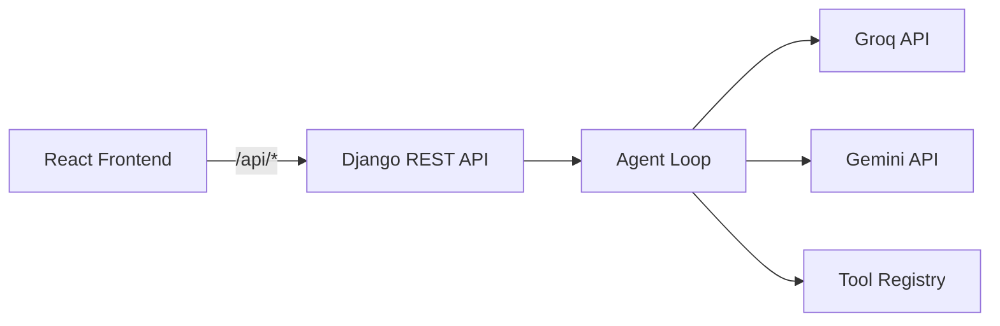

# Agentic AI — Django + React

Full-stack agentic AI assistant with **Groq** or **Google Gemini**, per-user **agents**, and a **tool registry**.

## Architecture



## Quick start

### Backend (Django)

```powershell
cd backend
python -m venv venv
.\venv\Scripts\activate
pip install -r requirements.txt
copy .env.example .env
# Edit .env: LLM_PROVIDER, GROQ_API_KEY or GEMINI_API_KEY
python manage.py migrate
python manage.py runserver 127.0.0.1:8000
# In a separate terminal, run the WebSocket streaming server:
python websocket_server.py
```

### Frontend

```powershell
cd frontend
npm install
npm run dev
```

Open **http://localhost:5173**

## Environment variables

| Variable | Description |
|----------|-------------|
| `LLM_PROVIDER` | `groq` (default) or `gemini` |
| `GROQ_API_KEY` | Key from [Groq Console](https://console.groq.com/keys) |
| `GROQ_MODEL` | e.g. `llama-3.3-70b-versatile` |
| `GEMINI_API_KEY` | Key from [Google AI Studio](https://aistudio.google.com/apikey) |
| `GEMINI_MODEL` | e.g. `gemini-2.5-flash` |
| `MAX_TOOL_ROUNDS` | Agent loop limit (default 8) |

## Authentication (JWT in cookies)

Login and register set **httpOnly** cookies (not accessible to JavaScript):

| Cookie | Purpose |
|--------|---------|
| `access_token` | JWT access token (1 hour default) |
| `refresh_token` | JWT refresh token (7 days default) |

| Method | Path | Auth |
|--------|------|------|
| POST | `/api/auth/register` | Public |
| POST | `/api/auth/login` | Public |
| POST | `/api/auth/logout` | Public |
| POST | `/api/auth/refresh` | Public (uses refresh cookie) |
| GET | `/api/auth/me` | Required |

All other `/api/*` routes require a valid `access_token` cookie (or `Authorization: Bearer` header).

Frontend sends `credentials: "include"` on every request so cookies are attached automatically.

## API endpoints

| Method | Path | Description |
|--------|------|-------------|
| GET | `/api/health` | Health check (public) |
| POST | `/api/chat` | Run agent (optional `agent_id`) |
| GET/POST | `/api/agents` | List / create agents |
| GET/PATCH/DELETE | `/api/agents/{id}` | Agent CRUD |
| PUT | `/api/agents/{id}/tools` | Assign tools to agent |
| GET/POST | `/api/tools` | List / create tools |
| GET/PATCH/DELETE | `/api/tools/{id}` | Tool CRUD |
| POST | `/api/tools/{id}/toggle` | Enable/disable |

## Project structure

```
backend/
  manage.py
  agentic_ai/          # Django settings & URLs
  api/                 # REST views (auth, chat, tools, agents)
  core/
    agent.py           # LLM provider router
    groq_agent.py      # Groq chat + tools
    gemini_agent.py    # Gemini chat + tools
    agents.py          # Agent CRUD
    tools/             # Tool registry & builtins
frontend/              # React UI
```

## User database

Accounts are stored in the **`users`** SQLite table (`core.models.User`). Register and login read/write this table via JWT cookies.

| Field | Purpose |
|-------|---------|
| `username` | Login name (unique) |
| `email` | Optional email |
| `password` | Hashed (never stored plain text) |
| `display_name` | Optional display label |
| `created_at` / `updated_at` | Timestamps |

View users in Django admin: **http://127.0.0.1:8000/admin/** (create a superuser with `python manage.py createsuperuser`).

After adding the `users` table, run `python manage.py migrate` (or `migrate core` first if needed). Existing accounts from the old default `auth_user` table are not migrated — sign up again.

## Tool database

All tools are stored in the **`agent_tools`** SQLite table (`core.models.AgentTool`). Built-in tools are seeded automatically on migrate.

| Field | Purpose |
|-------|---------|
| `name` | Function name for the LLM |
| `description` | When the LLM should call it |
| `parameters` | JSON Schema |
| `handler_type` | `builtin`, `http_api`, `echo_args`, `uppercase` |
| `api_url` | URL with `{param}` placeholders |
| `api_method` | GET, POST, etc. |

Use the **+ Add** panel in the UI (handler: **External HTTP API**) or `POST /api/tools`.

## Custom API tools

Create a tool with `handler_type: "http_api"`:

```json
{
  "name": "get_post",
  "description": "Fetch a blog post by id from JSONPlaceholder",
  "handler_type": "http_api",
  "api_url": "https://jsonplaceholder.typicode.com/posts/{id}",
  "api_method": "GET",
  "parameters": {
    "type": "object",
    "properties": {
      "id": { "type": "string", "description": "Post id" }
    },
    "required": ["id"]
  }
}
```

Use `{param}` in the URL or POST body template for argument substitution.
